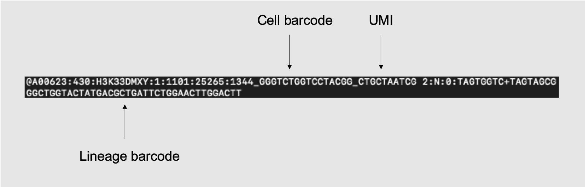
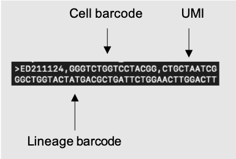

# TrackerSeq

TrackerSeq is a single-cell RNA sequencing compatible method (e.g. 10X genomics, plate-based sequencing, etc.) that labels cells with a unique lineage barcode. This repository contains a maintained TrackerSeq preprocessnig pipeline and preliminary analysis scripts including multi-core processing that can take raw FASTQ files and convert them into clonal annotations. 

This version contains several major updates as well as many minor bug fixes:
Major updates
* bartender_single_com from bartenderv1.1 is employed prior to N_READS and N_UMI filtering to cluster barcodes from sequencing reads. UMI counts are used cluster barcodes with possible sequence errors using a defined hamming threshold, giving cluster assignments and cluster entropy scores. These scores are used to map rarely observed barcodes only to quality centroids by hamming distance prior to reads aggregation and filtering.
* when computationally feasible, barcode statistics are computed for all reads prior to filtering, however this feature can be reduced or deactivated to accomodate large datasets
* cloneID assignment to cells using a network-based approach now incorporates Jaccard distance weighting of network edges paired with a heuristic-based, user-controlled jaccard thresholding strategy to reduce false positives while maintaining true positives

Previous major versions 
* The verison of the pipeline used in Del-Valle-Anton et al. 2024 found [here](https://github.com/mayer-lab/TrackerSeq/tree/main/Del-Valle-Anton_et_al/TrackerSeq_archived_pipeline)
* The original repository of the TrackerSeq pipeline can be found [here](https://github.com/mayer-lab/Bandler-et-al_lineage).

## Dependencies

* [BBTools](https://jgi.doe.gov/data-and-tools/software-tools/bbtools/)
* [Samtools](https://www.htslib.org/)
* [UMI-tools](https://umi-tools.readthedocs.io/en/latest/index.html)
* [bartender_v1.1]()
* Python libraries
  * NumPy
  * pandas
  * matplotlib
  * seaborn
  * itertools
  * Levenshtein

## NGS library design

## TrackerSeq processing pipeline steps

 The process is divided mainly into four steps: 

1. Pre-processing and barcode matching (**1_pre_process.sh**)
   * Input: Raw Read1 and Read2 files generated from next generation sequencing 
   * Output: 
     1. A fastq file with lineage barcode sequences and headers indicating cell barcode and UMI. 
     2. Cell barcode whitelist .txt file. 
2. Reformat (**2_reformat.ipynb** & caller shell script)
   * Input: The output of step 1 (fastq files of barcodes with headers indicating cell barcode and UMI)
     * 
   * Output:
     1. Reformmated FASTQ file that's LARRY compatible. 
        * 
     2. A CSV file of barcode strings that's bartender_single_com compatible
     3. A library .txt where each row indicates dataset origin of the lineage barcode. If done correctly, each row should have the same dataset. 
3. Clustering of barcodes bartender_v1.1 bartender_single_com (**3_bartender_clustering.sh**)
   * Input: 
     1. The csv of unique (umi) read strings from step 2.
     2. max hamming distance to perform clustering (default hamming = 5) and quality threshold for clustering which likely has little influence in practical use (default z = 5, recommended by developer)
   * Output: 
     1. 3 CSV files using PCR aware algorithm
        * umi quantification of all unique barcode sequences and cluster assignments, "pcr_barcodes.csv"
        * barcode clusters with centroid sequences and entropy scores "pcr_clusters.csv"
        * quality file which describes nucleotide-location errors detected in each barcode cluster "pcr_quality.csv"
4. Lineage Barcode identification (**4_LARRY_Klein.py**)
   * Input: 
     1. 2 CSVs from bartender_single_com "pcr_barcodes.csv" and "pcr_clusters.csv"
     2. The reformatted FASTQ file that's been converted to a LARRY compatible format from step 2.
     3. Library .txt file generated from step 2.
     4. A .txt file where each row is a cellbc. You can use the whitelist generated in step 1 or get the cell barcodes from your Seurat object. NOTE that doublets should be filtered out of the cell whitelist at this stage to ensure they do not confound lineage signatures!
   * Output: 
     1. CSV file in the form of an NxM binary matrix, where entry (i,j) is 1 if cell i is in clone j
     2. Numpy version of the NxM binary matrix
     3. A barcode npy file of the barcode collpasing dictionary with key value pairs barcode --> conscensus barcode
5. Matrix trimming and cellbc assignment (**5_cellbc_assign.ipynb**)
   * Input:
     1. NxM binary matrix CSV file from step 3
     2. Numpy version of the NxM binary from step 3
     3. Cell barcode whitelist generated from step 1 or single-cell transcriptome analysis (recommended to pre-filter doublets!)
   * Output:
     1. Trimmed matrix CSV file with cellbc column added
6. CloneID assignment (**06_add_clone_ids_v202409.R**)
   * Here we model clonal relationships as a network where nodes are cell-IDs (i.e. cells), which are connected if they share at least one common lineage barcode. Multi-core is avialable for network computation, where jaccard scores are computed for each edge between cells based on their barcode signatures. Once the network is constructed, it can be iteratively filtered according to this jaccard similarity metric, and clone statistics such as clone sizes, counts, and variances are graphed as a function of jaccard thresholds. The user then selects one or multiple thresholds for filtering network edges. The resulting connected components within these filtered networks are used to determine clonal assigment. Our recommendation is to use both strict and tuned thresholds for lineage analysis. For example, having perfectly matched barcode signals corresponds with a jaccard quality threshold of 1, which should be used as a "toptier" clone assingment in analysis, e.g. to support major claims. However, lower thresholds result in less splitting of clones due to rejection of true positives while still avoiding false positives most prevalent at low jaccard scores, which provides valuable depth to lineage datasets for optimal analysis of high-throughput datasets that capture complex clonal dynamics. 
   * A python version of this notebook with substantially faster performance is in development and can be requested via email

   * Input: 
     1. Trimmed sparse matrix CSV file from step 4.
   * Output:
     1. CSV table with cloneIDs for each cellbarcode, which can be generated for multiple jaccard similarity thresholds. 
     2. Heuristic plots of clonal statistics as a function of jaccard metric thresholding

